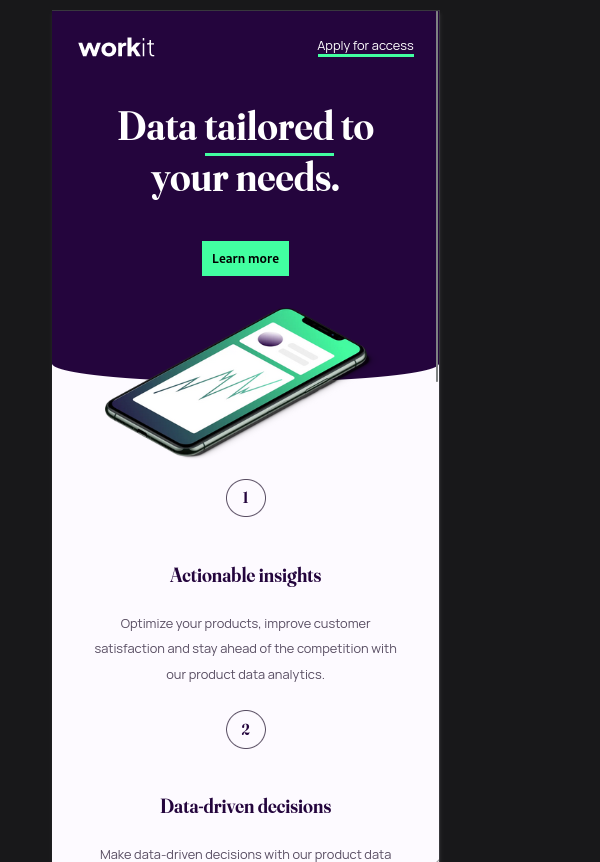
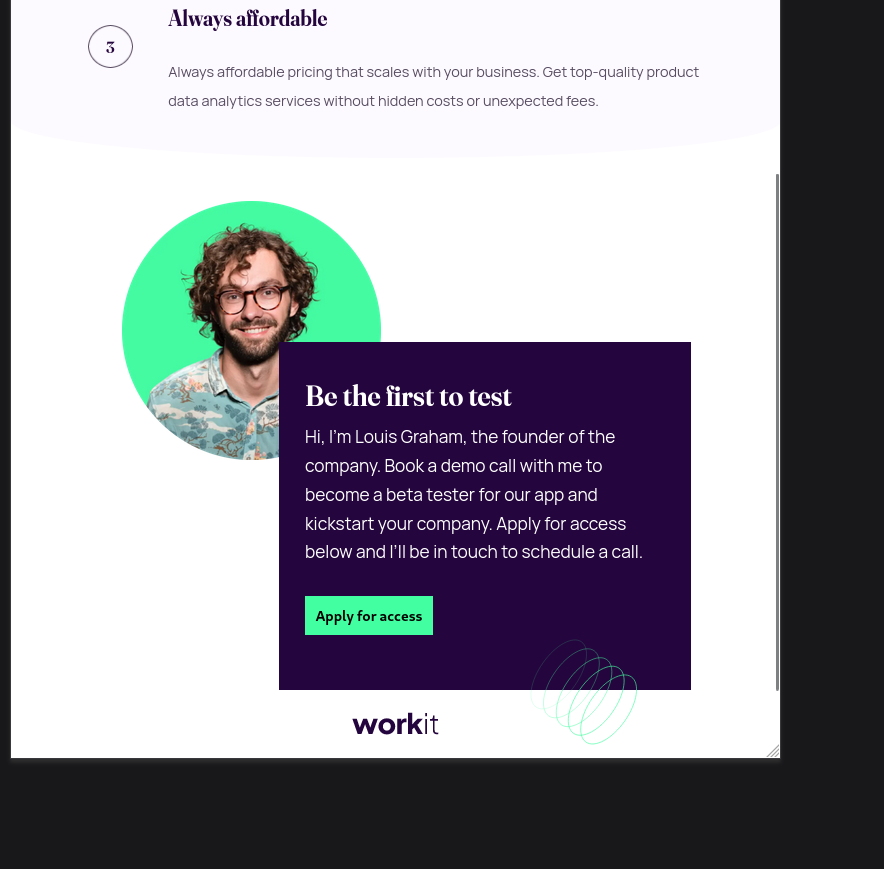

# Frontend Mentor - Workit landing page by Juan Nava

This is a solution to the [Workit landing page challenge on Frontend Mentor](https://www.frontendmentor.io/challenges/workit-landing-page-2fYnyle5lu). Frontend Mentor challenges help you improve your coding skills by building realistic projects. 

## Table of contents

- [Overview](#overview)
  - [The challenge](#the-challenge)
  - [Screenshot](#screenshot)
  - [Links](#links)
- [My process](#my-process)
  - [Built with](#built-with)
  - [What I learned](#what-i-learned)
  - [Continued development](#continued-development)
- [Author](#author)
- [Acknowledgments](#acknowledgments)

## Overview

### The challenge

Users should be able to:

- View the optimal layout for the interface depending on their device's screen size
- See hover and focus states for all interactive elements on the page

### Screenshot
<div style="display:flex">
  
  
</div>

### Links
Link to the solution: https://workit-landing-page-nava.netlify.app/

## My process

### Built with
- Semantic HTML5 markup
- CSS custom properties
- Flexbox

### What I learned
``` 
First of all, I wanna say that this challenge was a good one for me because of the very little details that are behind the structure, like for example the border at the bottom of the first two sections or the position of the images in it... nevertheless I enjoyed the time spend in this challenge and I am very excited for acquire more knowledge about css and html in the new ones!
```
## Author

- Juan Nava
- Profile on FrontEnd Mentor: https://www.frontendmentor.io/profile/juannava67 